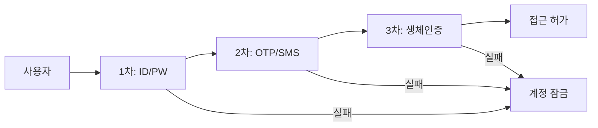
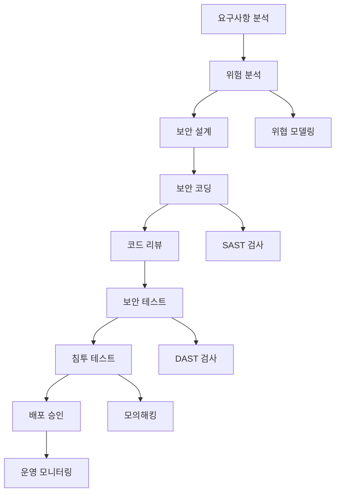

# K-BANK 데이터관리 솔루션 보안 및 컴플라이언스 설계서

**버전:** 1.0  
**작성일:** 2025-11-25  
**기반:** RFP 보안 요구사항, 금융권 규제, K-BANK 정보보호 정책  
**준수 규정:** 전자금융감독규정, 개인정보보호법, 신용정보법

---

## 📋 보안 설계 개요

### 설계 목적
- 케이뱅크 데이터관리 솔루션의 전방위 보안 체계 구축
- 금융권 규제 및 K-BANK 정보보호 정책 완전 준수
- 개인정보 및 중요정보 보호를 위한 다층 보안 구조
- 내부 위협과 외부 공격에 대한 종합적 방어 체계

### 보안 목표
1. **기밀성 (Confidentiality)**: 인가되지 않은 접근으로부터 정보 보호
2. **무결성 (Integrity)**: 데이터의 정확성 및 완전성 보장
3. **가용성 (Availability)**: 서비스의 지속적 제공 보장
4. **추적성 (Accountability)**: 모든 접근 및 변경 이력 추적
5. **부인방지 (Non-repudiation)**: 행위에 대한 부인 방지

### 준수해야 할 규정
- **전자금융감독규정** (금융위원회/금융감독원)
- **개인정보보호법** (개인정보보호위원회)
- **신용정보의 이용 및 보호에 관한 법률** (금융위원회)
- **정보통신망 이용촉진 및 정보보호 등에 관한 법률**
- **K-BANK 정보보호 관리규정**

---

## 🛡️ 전체 보안 아키텍처

### 보안 아키텍처 개요
```
┌─────────────────────────────────────────────────────────────┐
│                    External Security Layer                  │
├─────────────────────────────────────────────────────────────┤
│ Internet → Firewall → WAF → DDoS Protection → CDN          │
└─────────────────────────────────────────────────────────────┘
                              ↓
┌─────────────────────────────────────────────────────────────┐
│                    Network Security Layer                   │
├─────────────────────────────────────────────────────────────┤
│ VPN Gateway → IDS/IPS → Network Segmentation → VLAN        │
└─────────────────────────────────────────────────────────────┘
                              ↓
┌─────────────────────────────────────────────────────────────┐
│                  Application Security Layer                 │
├─────────────────────────────────────────────────────────────┤
│ API Gateway → OAuth2/JWT → Rate Limiting → Input Validation│
└─────────────────────────────────────────────────────────────┘
                              ↓
┌─────────────────────────────────────────────────────────────┐
│                    Data Security Layer                      │
├─────────────────────────────────────────────────────────────┤
│ Encryption at Rest → Encryption in Transit → Data Masking  │
└─────────────────────────────────────────────────────────────┘
                              ↓
┌─────────────────────────────────────────────────────────────┐
│                  Infrastructure Security                    │
├─────────────────────────────────────────────────────────────┤
│ OS Hardening → Access Control → Audit Logging → Monitoring │
└─────────────────────────────────────────────────────────────┘
```

---

## 🔐 1. 인증 및 접근 제어

### 1.1 다단계 인증 (Multi-Factor Authentication)

#### 인증 단계


#### 구현 방법
```java
@Service
public class MultiFactorAuthenticationService {
    
    @Autowired
    private UserRepository userRepository;
    
    @Autowired
    private OTPService otpService;
    
    @Autowired
    private BiometricService biometricService;
    
    public AuthenticationResult authenticate(AuthenticationRequest request) {
        // 1단계: 기본 인증 (ID/Password)
        User user = validateCredentials(request.getUsername(), request.getPassword());
        if (user == null) {
            throw new AuthenticationException("Invalid credentials");
        }
        
        // 2단계: OTP 검증
        if (!otpService.verifyOTP(user.getUserId(), request.getOtpCode())) {
            throw new AuthenticationException("Invalid OTP");
        }
        
        // 3단계: 생체 인증 (선택적)
        if (user.isBiometricEnabled()) {
            if (!biometricService.verify(user.getUserId(), request.getBiometricData())) {
                throw new AuthenticationException("Biometric verification failed");
            }
        }
        
        // JWT 토큰 생성
        String accessToken = jwtService.generateToken(user);
        
        // 로그인 이력 기록
        auditService.logLogin(user, request.getClientIP(), request.getUserAgent());
        
        return new AuthenticationResult(accessToken, user);
    }
}
```

### 1.2 역할 기반 접근 제어 (RBAC)

#### 역할 계층 구조
```
관리자 (Administrator)
├── 시스템관리자 (System Admin)
│   ├── 사용자 관리
│   ├── 시스템 설정
│   └── 모든 데이터 접근
├── 데이터관리자 (Data Admin) 
│   ├── 메타데이터 관리
│   ├── 표준 승인
│   └── 품질 관리
└── 보안관리자 (Security Admin)
    ├── 접근 권한 관리
    ├── 보안 정책 설정
    └── 감사 로그 조회

사용자 (User)
├── 데이터모델러 (Data Modeler)
│   ├── 모델링 도구 사용
│   ├── ERD 작성/수정
│   └── 모델 승인 요청
├── 데이터분석가 (Data Analyst)
│   ├── 메타데이터 조회
│   ├── AI 질의 사용
│   └── 데이터 흐름 분석
└── 일반사용자 (General User)
    ├── 메타데이터 조회
    └── 기본 검색 기능
```

#### 권한 매트릭스
```sql
-- 권한 매트릭스 테이블
CREATE TABLE system_mgmt.permission_matrix (
    role_id VARCHAR(50),
    resource_type VARCHAR(50), -- TABLE, COLUMN, API, MENU
    resource_id VARCHAR(50),
    permission_type VARCHAR(20), -- CREATE, READ, UPDATE, DELETE, EXECUTE
    is_granted BOOLEAN DEFAULT FALSE,
    conditions TEXT, -- JSON 형태의 조건 (시간, IP 등)
    created_datetime TIMESTAMP DEFAULT CURRENT_TIMESTAMP
);

-- 권한 확인 함수
CREATE OR REPLACE FUNCTION check_permission(
    p_user_id VARCHAR(50),
    p_resource_type VARCHAR(50),
    p_resource_id VARCHAR(50),
    p_permission_type VARCHAR(20)
) RETURNS BOOLEAN AS $$
DECLARE
    has_permission BOOLEAN := FALSE;
BEGIN
    SELECT COALESCE(pm.is_granted, FALSE) INTO has_permission
    FROM system_mgmt.sys_user_role_mapping urm
    JOIN system_mgmt.permission_matrix pm ON urm.role_id = pm.role_id
    WHERE urm.user_id = p_user_id
      AND pm.resource_type = p_resource_type
      AND (pm.resource_id = p_resource_id OR pm.resource_id = '*')
      AND pm.permission_type = p_permission_type
      AND urm.is_active = TRUE
    ORDER BY pm.resource_id DESC -- 구체적 권한이 우선
    LIMIT 1;
    
    RETURN COALESCE(has_permission, FALSE);
END;
$$ LANGUAGE plpgsql;
```

### 1.3 최소 권한 원칙 (Principle of Least Privilege)

#### 동적 권한 할당
```java
@Component
public class DynamicPermissionManager {
    
    public Set<String> calculateUserPermissions(String userId, String contextData) {
        Set<String> permissions = new HashSet<>();
        
        // 기본 역할 권한
        permissions.addAll(getRoleBasedPermissions(userId));
        
        // 데이터 분류별 권한
        permissions.addAll(getDataClassificationPermissions(userId));
        
        // 시간/장소 기반 권한
        permissions.addAll(getContextualPermissions(userId, contextData));
        
        // 임시 권한 (승인된 경우)
        permissions.addAll(getTemporaryPermissions(userId));
        
        return permissions;
    }
    
    private Set<String> getDataClassificationPermissions(String userId) {
        // 사용자의 보안 등급에 따른 데이터 접근 권한 계산
        SecurityLevel userLevel = userService.getSecurityLevel(userId);
        
        return switch (userLevel) {
            case TOP_SECRET -> Set.of("RESTRICTED", "CONFIDENTIAL", "INTERNAL", "PUBLIC");
            case SECRET -> Set.of("CONFIDENTIAL", "INTERNAL", "PUBLIC");
            case CONFIDENTIAL -> Set.of("INTERNAL", "PUBLIC");
            case PUBLIC -> Set.of("PUBLIC");
        };
    }
}
```

---

## 🔒 2. 데이터 보안

### 2.1 암호화 체계

#### 전송 중 암호화 (Encryption in Transit)
```yaml
# TLS 설정
server:
  ssl:
    enabled: true
    protocol: TLS
    enabled-protocols: TLSv1.3
    ciphers: 
      - TLS_AES_256_GCM_SHA384
      - TLS_CHACHA20_POLY1305_SHA256
      - TLS_AES_128_GCM_SHA256
    key-store: classpath:kbank-keystore.p12
    key-store-password: ${SSL_KEYSTORE_PASSWORD}
    key-store-type: PKCS12
```

#### 저장 시 암호화 (Encryption at Rest)
```java
@Entity
@Table(name = "sensitive_customer_data")
public class SensitiveCustomerData {
    
    @Id
    private String customerId;
    
    @Column(name = "customer_name")
    @Convert(converter = AESEncryptionConverter.class)
    private String customerName;
    
    @Column(name = "phone_number")
    @Convert(converter = AESEncryptionConverter.class)
    private String phoneNumber;
    
    @Column(name = "email")
    @Convert(converter = AESEncryptionConverter.class)
    private String email;
    
    @Column(name = "ssn")
    @Convert(converter = RSAEncryptionConverter.class) // 더 강한 암호화
    private String socialSecurityNumber;
}

@Converter
public class AESEncryptionConverter implements AttributeConverter<String, String> {
    
    private final AESUtil aesUtil;
    
    @Override
    public String convertToDatabaseColumn(String attribute) {
        if (attribute == null) return null;
        try {
            return aesUtil.encrypt(attribute, getEncryptionKey());
        } catch (Exception e) {
            throw new RuntimeException("Encryption failed", e);
        }
    }
    
    @Override
    public String convertToEntityAttribute(String dbData) {
        if (dbData == null) return null;
        try {
            return aesUtil.decrypt(dbData, getDecryptionKey());
        } catch (Exception e) {
            throw new RuntimeException("Decryption failed", e);
        }
    }
    
    private String getEncryptionKey() {
        // HSM 또는 Key Vault에서 키 조회
        return keyManagementService.getKey("CUSTOMER_DATA_ENCRYPTION_KEY");
    }
}
```

#### 키 관리 시스템 (Key Management System)
```java
@Service
public class KeyManagementService {
    
    private final HSMClient hsmClient;
    
    public String getEncryptionKey(String keyId) {
        // HSM에서 암호화 키 조회
        try {
            return hsmClient.retrieveKey(keyId);
        } catch (HSMException e) {
            // 장애 시 로컬 백업 키 사용
            return localKeyStore.getBackupKey(keyId);
        }
    }
    
    public void rotateKey(String keyId) {
        // 주기적 키 로테이션
        String newKey = hsmClient.generateKey();
        String oldKey = hsmClient.retrieveKey(keyId);
        
        // 점진적 키 교체
        keyRotationService.scheduleKeyRotation(keyId, oldKey, newKey);
    }
}
```

### 2.2 데이터 마스킹 및 익명화

#### 동적 데이터 마스킹
```java
@Component
public class DataMaskingService {
    
    public String maskData(String originalData, String dataType, String userRole) {
        return switch (dataType) {
            case "NAME" -> maskName(originalData, userRole);
            case "PHONE" -> maskPhoneNumber(originalData, userRole);
            case "EMAIL" -> maskEmail(originalData, userRole);
            case "SSN" -> maskSSN(originalData, userRole);
            case "CARD_NUMBER" -> maskCardNumber(originalData, userRole);
            default -> originalData;
        };
    }
    
    private String maskName(String name, String userRole) {
        if ("ADMIN".equals(userRole) || "DATA_ADMIN".equals(userRole)) {
            return name; // 관리자는 마스킹 없음
        }
        
        if (name.length() <= 2) {
            return "*".repeat(name.length());
        }
        
        // 첫 글자만 보이고 나머지는 마스킹
        return name.charAt(0) + "*".repeat(name.length() - 1);
    }
    
    private String maskPhoneNumber(String phone, String userRole) {
        if ("ADMIN".equals(userRole)) {
            return phone;
        }
        
        // 010-****-5678 형태로 마스킹
        if (phone.matches("\\d{3}-\\d{4}-\\d{4}")) {
            String[] parts = phone.split("-");
            return parts[0] + "-****-" + parts[2];
        }
        
        return phone.replaceAll("\\d", "*");
    }
}
```

#### 데이터 익명화 정책
```sql
-- 테스트 환경용 데이터 익명화 뷰
CREATE OR REPLACE VIEW test_env.v_anonymized_customer AS
SELECT 
    customer_id,
    CASE 
        WHEN LENGTH(customer_name) > 0 THEN '테스트고객' || LPAD(ROW_NUMBER() OVER (ORDER BY customer_id)::text, 4, '0')
        ELSE NULL 
    END AS customer_name,
    CASE 
        WHEN phone_number IS NOT NULL THEN '010-0000-' || LPAD((RANDOM() * 9999)::int::text, 4, '0')
        ELSE NULL 
    END AS phone_number,
    CASE 
        WHEN email IS NOT NULL THEN 'test' || LPAD(ROW_NUMBER() OVER (ORDER BY customer_id)::text, 4, '0') || '@test.com'
        ELSE NULL 
    END AS email,
    birth_date,
    created_date,
    modified_date
FROM customer
WHERE is_test_data = FALSE; -- 운영 데이터만 익명화하여 제공
```

### 2.3 개인정보 보호

#### 개인정보 식별 및 분류
```java
@Component
public class PersonalDataClassifier {
    
    private static final Map<String, PersonalInfoType> COLUMN_PATTERNS = Map.of(
        ".*name.*", PersonalInfoType.NAME,
        ".*phone.*", PersonalInfoType.PHONE,
        ".*email.*", PersonalInfoType.EMAIL,
        ".*address.*", PersonalInfoType.ADDRESS,
        ".*ssn.*|.*주민.*", PersonalInfoType.SSN,
        ".*card.*number.*", PersonalInfoType.CARD_NUMBER
    );
    
    public List<PersonalInfoColumn> identifyPersonalInfo(Table table) {
        List<PersonalInfoColumn> personalInfoColumns = new ArrayList<>();
        
        for (Column column : table.getColumns()) {
            PersonalInfoType type = classifyColumn(column);
            if (type != null) {
                PersonalInfoColumn piColumn = new PersonalInfoColumn(
                    column.getColumnId(),
                    column.getColumnName(),
                    type,
                    calculateSensitivityScore(column, type),
                    determineProtectionRequirement(type)
                );
                personalInfoColumns.add(piColumn);
            }
        }
        
        return personalInfoColumns;
    }
    
    private PersonalInfoType classifyColumn(Column column) {
        String columnName = column.getColumnName().toLowerCase();
        String columnComment = column.getColumnComment();
        
        for (Map.Entry<String, PersonalInfoType> entry : COLUMN_PATTERNS.entrySet()) {
            if (columnName.matches(entry.getKey()) || 
                (columnComment != null && columnComment.toLowerCase().contains(entry.getValue().name()))) {
                return entry.getValue();
            }
        }
        
        // AI 기반 분류 (추가)
        return aiClassificationService.classifyColumn(column);
    }
}
```

#### GDPR/개인정보보호법 준수
```java
@Service
public class PrivacyComplianceService {
    
    public void processDataSubjectRequest(DataSubjectRequest request) {
        switch (request.getRequestType()) {
            case ACCESS_REQUEST -> handleAccessRequest(request);
            case RECTIFICATION_REQUEST -> handleRectificationRequest(request);
            case ERASURE_REQUEST -> handleErasureRequest(request);
            case PORTABILITY_REQUEST -> handlePortabilityRequest(request);
            case OBJECTION_REQUEST -> handleObjectionRequest(request);
        }
        
        // 처리 이력 기록
        auditService.logDataSubjectRequest(request);
    }
    
    private void handleErasureRequest(DataSubjectRequest request) {
        String customerId = request.getCustomerId();
        
        // 개인정보 파기 대상 테이블 조회
        List<Table> personalInfoTables = metadataService.getPersonalInfoTables();
        
        for (Table table : personalInfoTables) {
            // 보존 의무 기간 확인
            if (isWithinRetentionPeriod(table, customerId)) {
                throw new RetentionPeriodException("보존 의무 기간 내 데이터는 파기할 수 없습니다.");
            }
            
            // 개인정보 삭제 또는 익명화
            personalDataDeletionService.deleteOrAnonymize(table, customerId);
        }
        
        // 파기 완료 통지
        notificationService.sendDataDeletionConfirmation(request.getRequesterId());
    }
}
```

---

## 🛡️ 3. 네트워크 보안

### 3.1 네트워크 분할 및 격리

#### 네트워크 세그멘테이션
```
DMZ Zone (210.xxx.xxx.0/24)
├── Web Application Firewall
├── Load Balancer
└── Reverse Proxy

Management Zone (172.16.1.0/24)  
├── Bastion Host
├── Monitoring Systems
└── Backup Systems

Application Zone (172.16.10.0/24)
├── API Gateway
├── Application Servers
└── Cache Servers

Database Zone (172.16.20.0/24)
├── Primary Database
├── Replica Database
└── Backup Database

Security Zone (172.16.30.0/24)
├── SIEM Server
├── Log Aggregation
└── Security Tools
```

#### 방화벽 규칙
```bash
# 인바운드 규칙
iptables -A INPUT -p tcp --dport 443 -s 0.0.0.0/0 -j ACCEPT    # HTTPS
iptables -A INPUT -p tcp --dport 22 -s 172.16.1.0/24 -j ACCEPT # SSH (관리 네트워크만)
iptables -A INPUT -p tcp --dport 8080 -s 172.16.10.0/24 -j ACCEPT # API (앱 네트워크만)

# 아웃바운드 규칙  
iptables -A OUTPUT -p tcp --dport 5432 -d 172.16.20.0/24 -j ACCEPT # DB 접근
iptables -A OUTPUT -p tcp --dport 443 -j ACCEPT  # 외부 API 호출
iptables -A OUTPUT -p tcp --dport 53 -j ACCEPT   # DNS

# 기본 정책
iptables -P INPUT DROP
iptables -P OUTPUT DROP
iptables -P FORWARD DROP
```

### 3.2 침입 탐지 및 방지 시스템

#### IDS/IPS 설정
```yaml
# Suricata 설정
suricata:
  rules:
    - path: /etc/suricata/rules/kbank-custom.rules
    - path: /etc/suricata/rules/emerging-threats.rules
    
  outputs:
    - fast:
        enabled: true
        filename: fast.log
    - eve-log:
        enabled: true
        filetype: json
        filename: eve.json
        types:
          - alert
          - http
          - dns
          - tls

# 커스텀 규칙
# /etc/suricata/rules/kbank-custom.rules
alert tcp any any -> 172.16.20.0/24 5432 (msg:"Database access from unauthorized network"; \
    content:"postgresql"; sid:1000001; rev:1;)

alert http any any -> any any (msg:"SQL Injection attempt"; \
    content:"union select"; nocase; sid:1000002; rev:1;)

alert http any any -> any any (msg:"XSS attempt"; \
    content:"<script>"; nocase; sid:1000003; rev:1;)
```

### 3.3 VPN 및 원격 접근 보안

#### VPN 접근 제어
```java
@Component
public class VPNAccessController {
    
    public boolean validateVPNAccess(String userId, String clientIP, String certificate) {
        // 1. 인증서 유효성 검사
        if (!certificateValidator.isValid(certificate)) {
            return false;
        }
        
        // 2. 사용자 VPN 권한 확인
        if (!hasVPNPermission(userId)) {
            return false;
        }
        
        // 3. IP 화이트리스트 확인
        if (!ipWhitelist.contains(clientIP)) {
            return false;
        }
        
        // 4. 시간 기반 접근 제어
        if (!isWithinAllowedTime(userId)) {
            return false;
        }
        
        // 5. 동시 접속 수 제한
        if (getCurrentConnections(userId) >= getMaxConnections(userId)) {
            return false;
        }
        
        return true;
    }
}
```

---

## 🔍 4. 애플리케이션 보안

### 4.1 입력 검증 및 출력 인코딩

#### SQL 인젝션 방지
```java
@Repository
public class SecureMetadataRepository {
    
    @Autowired
    private JdbcTemplate jdbcTemplate;
    
    // 안전한 쿼리 (Prepared Statement 사용)
    public List<Table> findTablesBySchema(String dbId, String schemaName) {
        String sql = "SELECT * FROM metadata.md_table_info WHERE db_id = ? AND schema_name = ?";
        
        return jdbcTemplate.query(sql, 
            new Object[]{dbId, schemaName},
            new TableRowMapper());
    }
    
    // 동적 쿼리의 경우 화이트리스트 기반 검증
    public List<Table> findTablesWithDynamicSort(String sortColumn, String sortDirection) {
        // 정렬 컬럼 화이트리스트 검증
        if (!ALLOWED_SORT_COLUMNS.contains(sortColumn)) {
            throw new InvalidParameterException("Invalid sort column: " + sortColumn);
        }
        
        // 정렬 방향 검증
        if (!"ASC".equalsIgnoreCase(sortDirection) && !"DESC".equalsIgnoreCase(sortDirection)) {
            throw new InvalidParameterException("Invalid sort direction: " + sortDirection);
        }
        
        String sql = String.format("SELECT * FROM metadata.md_table_info ORDER BY %s %s", 
                                 sortColumn, sortDirection);
        
        return jdbcTemplate.query(sql, new TableRowMapper());
    }
}
```

#### XSS 방지
```java
@Component
public class XSSProtectionFilter implements Filter {
    
    @Override
    public void doFilter(ServletRequest request, ServletResponse response, 
                        FilterChain chain) throws IOException, ServletException {
        
        XSSRequestWrapper wrappedRequest = new XSSRequestWrapper((HttpServletRequest) request);
        chain.doFilter(wrappedRequest, response);
    }
}

public class XSSRequestWrapper extends HttpServletRequestWrapper {
    
    private static final Pattern[] XSS_PATTERNS = {
        Pattern.compile("<script[^>]*>.*?</script>", Pattern.CASE_INSENSITIVE),
        Pattern.compile("javascript:", Pattern.CASE_INSENSITIVE),
        Pattern.compile("onload\\s*=", Pattern.CASE_INSENSITIVE),
        Pattern.compile("onerror\\s*=", Pattern.CASE_INSENSITIVE)
    };
    
    @Override
    public String getParameter(String parameter) {
        String value = super.getParameter(parameter);
        return sanitizeInput(value);
    }
    
    @Override
    public String[] getParameterValues(String parameter) {
        String[] values = super.getParameterValues(parameter);
        if (values == null) return null;
        
        return Arrays.stream(values)
                    .map(this::sanitizeInput)
                    .toArray(String[]::new);
    }
    
    private String sanitizeInput(String input) {
        if (input == null) return null;
        
        String sanitized = input;
        for (Pattern pattern : XSS_PATTERNS) {
            sanitized = pattern.matcher(sanitized).replaceAll("");
        }
        
        return StringEscapeUtils.escapeHtml4(sanitized);
    }
}
```

### 4.2 CSRF 방지

#### CSRF 토큰 구현
```java
@Configuration
@EnableWebSecurity
public class CSRFSecurityConfig {
    
    @Bean
    public SecurityFilterChain filterChain(HttpSecurity http) throws Exception {
        http
            .csrf(csrf -> csrf
                .csrfTokenRepository(CookieCsrfTokenRepository.withHttpOnlyFalse())
                .csrfTokenRequestHandler(new CSRFTokenRequestAttributeHandler())
                .ignoringRequestMatchers("/api/v1/auth/login") // 로그인은 CSRF 제외
            )
            .sessionManagement(session -> session
                .sessionCreationPolicy(SessionCreationPolicy.STATELESS)
            );
        
        return http.build();
    }
}

// React에서 CSRF 토큰 사용
@RestController
public class CSRFController {
    
    @GetMapping("/api/v1/csrf-token")
    public Map<String, String> getCsrfToken(HttpServletRequest request) {
        CsrfToken csrfToken = (CsrfToken) request.getAttribute("_csrf");
        return Map.of("token", csrfToken.getToken());
    }
}
```

### 4.3 API 보안

#### Rate Limiting
```java
@Component
public class RateLimitingFilter implements Filter {
    
    private final RedisTemplate<String, String> redisTemplate;
    private final RateLimitConfig rateLimitConfig;
    
    @Override
    public void doFilter(ServletRequest request, ServletResponse response, 
                        FilterChain chain) throws IOException, ServletException {
        
        HttpServletRequest httpRequest = (HttpServletRequest) request;
        String clientId = extractClientId(httpRequest);
        String endpoint = httpRequest.getRequestURI();
        
        RateLimit rateLimit = rateLimitConfig.getRateLimit(endpoint);
        
        if (!isRequestAllowed(clientId, endpoint, rateLimit)) {
            HttpServletResponse httpResponse = (HttpServletResponse) response;
            httpResponse.setStatus(HttpStatus.TOO_MANY_REQUESTS.value());
            httpResponse.getWriter().write("Rate limit exceeded");
            return;
        }
        
        chain.doFilter(request, response);
    }
    
    private boolean isRequestAllowed(String clientId, String endpoint, RateLimit rateLimit) {
        String key = String.format("rate_limit:%s:%s", clientId, endpoint);
        String currentCount = redisTemplate.opsForValue().get(key);
        
        if (currentCount == null) {
            redisTemplate.opsForValue().set(key, "1", Duration.ofSeconds(rateLimit.getWindowSeconds()));
            return true;
        }
        
        int count = Integer.parseInt(currentCount);
        if (count >= rateLimit.getMaxRequests()) {
            return false;
        }
        
        redisTemplate.opsForValue().increment(key);
        return true;
    }
}
```

#### API 키 관리
```java
@Service
public class APIKeyService {
    
    public APIKey generateAPIKey(String userId, Set<String> scopes) {
        String keyValue = generateSecureRandomKey();
        String hashedKey = hashAPIKey(keyValue);
        
        APIKey apiKey = APIKey.builder()
            .keyId(UUID.randomUUID().toString())
            .userId(userId)
            .hashedKey(hashedKey)
            .scopes(scopes)
            .expiresAt(LocalDateTime.now().plusMonths(6))
            .isActive(true)
            .build();
            
        apiKeyRepository.save(apiKey);
        
        // 원본 키는 한 번만 반환 (저장하지 않음)
        return apiKey.withKeyValue(keyValue);
    }
    
    public boolean validateAPIKey(String providedKey, String endpoint) {
        String hashedKey = hashAPIKey(providedKey);
        Optional<APIKey> apiKeyOpt = apiKeyRepository.findByHashedKey(hashedKey);
        
        if (apiKeyOpt.isEmpty()) {
            return false;
        }
        
        APIKey apiKey = apiKeyOpt.get();
        
        // 만료 확인
        if (apiKey.getExpiresAt().isBefore(LocalDateTime.now())) {
            return false;
        }
        
        // 스코프 확인
        if (!hasRequiredScope(apiKey.getScopes(), endpoint)) {
            return false;
        }
        
        // 마지막 사용 시간 업데이트
        apiKey.setLastUsedAt(LocalDateTime.now());
        apiKeyRepository.save(apiKey);
        
        return true;
    }
}
```

---

## 📊 5. 감사 및 모니터링

### 5.1 포괄적 감사 로깅

#### 감사 로그 구조
```java
@Entity
@Table(name = "comprehensive_audit_log")
public class ComprehensiveAuditLog {
    
    @Id
    private String auditId;
    
    // 기본 정보
    private String userId;
    private String sessionId;
    private String clientIP;
    private String userAgent;
    private LocalDateTime timestamp;
    
    // 액션 정보
    private String actionType; // CREATE, READ, UPDATE, DELETE, LOGIN, LOGOUT
    private String resourceType; // TABLE, COLUMN, USER, ROLE
    private String resourceId;
    private String resourceName;
    
    // 변경 정보 (UPDATE의 경우)
    @Column(columnDefinition = "TEXT")
    private String oldValues; // JSON
    
    @Column(columnDefinition = "TEXT") 
    private String newValues; // JSON
    
    // 요청 정보
    @Column(columnDefinition = "TEXT")
    private String requestParameters; // JSON
    
    private String httpMethod;
    private String requestUrl;
    private Integer responseStatus;
    private Long responseTimeMs;
    
    // 보안 정보
    private String riskLevel; // HIGH, MEDIUM, LOW
    private Boolean sensitiveDataAccess;
    private String accessContext; // BUSINESS_HOUR, AFTER_HOUR, WEEKEND
    
    // 지리적 정보
    private String geoLocation;
    private Boolean suspiciousLocation;
}
```

#### 감사 로그 자동 생성
```java
@Aspect
@Component
public class AuditLoggingAspect {
    
    @Autowired
    private AuditService auditService;
    
    @Around("@annotation(Auditable)")
    public Object auditMethodExecution(ProceedingJoinPoint joinPoint) throws Throwable {
        long startTime = System.currentTimeMillis();
        String methodName = joinPoint.getSignature().getName();
        Object[] args = joinPoint.getArgs();
        
        // 요청 정보 수집
        HttpServletRequest request = getCurrentRequest();
        String userId = SecurityContextHolder.getContext().getAuthentication().getName();
        
        try {
            Object result = joinPoint.proceed();
            
            // 성공 감사 로그
            auditService.logSuccess(
                userId,
                methodName,
                args,
                result,
                System.currentTimeMillis() - startTime,
                request
            );
            
            return result;
            
        } catch (Exception e) {
            // 실패 감사 로그
            auditService.logFailure(
                userId,
                methodName,
                args,
                e.getMessage(),
                System.currentTimeMillis() - startTime,
                request
            );
            
            throw e;
        }
    }
}

// 사용 예시
@Service
public class MetadataService {
    
    @Auditable(resourceType = "TABLE", actionType = "UPDATE")
    public Table updateTable(String tableId, Table tableData) {
        // 테이블 업데이트 로직
    }
    
    @Auditable(resourceType = "COLUMN", actionType = "READ", sensitiveData = true)
    public List<Column> getPersonalInfoColumns(String tableId) {
        // 개인정보 컬럼 조회 로직
    }
}
```

### 5.2 실시간 보안 모니터링

#### 이상 행위 탐지
```java
@Service
public class AnomalyDetectionService {
    
    @Scheduled(fixedRate = 60000) // 1분마다 실행
    public void detectAnomalousActivity() {
        LocalDateTime now = LocalDateTime.now();
        LocalDateTime lookbackTime = now.minusMinutes(5);
        
        // 1. 비정상적인 대량 조회 탐지
        detectMassDataAccess(lookbackTime, now);
        
        // 2. 비정상 시간대 접근 탐지
        detectAfterHoursAccess(lookbackTime, now);
        
        // 3. 지리적 이상 접근 탐지
        detectGeoAnomalies(lookbackTime, now);
        
        // 4. 권한 상승 시도 탐지
        detectPrivilegeEscalation(lookbackTime, now);
        
        // 5. 데이터 반출 시도 탐지
        detectDataExfiltration(lookbackTime, now);
    }
    
    private void detectMassDataAccess(LocalDateTime start, LocalDateTime end) {
        String sql = """
            SELECT user_id, COUNT(*) as access_count
            FROM comprehensive_audit_log 
            WHERE timestamp BETWEEN ? AND ?
              AND action_type = 'READ'
              AND resource_type IN ('TABLE', 'COLUMN')
            GROUP BY user_id
            HAVING COUNT(*) > 100
            """;
        
        List<Map<String, Object>> results = jdbcTemplate.queryForList(sql, start, end);
        
        for (Map<String, Object> result : results) {
            String userId = (String) result.get("user_id");
            Long accessCount = (Long) result.get("access_count");
            
            SecurityAlert alert = SecurityAlert.builder()
                .alertType("MASS_DATA_ACCESS")
                .severity(Severity.HIGH)
                .userId(userId)
                .description(String.format("사용자 %s가 5분 내에 %d회의 대량 데이터 접근을 시도했습니다.", userId, accessCount))
                .timestamp(LocalDateTime.now())
                .build();
                
            securityAlertService.raiseAlert(alert);
        }
    }
    
    private void detectAfterHoursAccess(LocalDateTime start, LocalDateTime end) {
        int currentHour = LocalDateTime.now().getHour();
        
        // 업무시간 외 접근 (22시~6시)
        if (currentHour >= 22 || currentHour <= 6) {
            String sql = """
                SELECT user_id, COUNT(*) as access_count
                FROM comprehensive_audit_log 
                WHERE timestamp BETWEEN ? AND ?
                  AND sensitive_data_access = true
                GROUP BY user_id
                """;
            
            List<Map<String, Object>> results = jdbcTemplate.queryForList(sql, start, end);
            
            for (Map<String, Object> result : results) {
                SecurityAlert alert = SecurityAlert.builder()
                    .alertType("AFTER_HOURS_SENSITIVE_ACCESS")
                    .severity(Severity.MEDIUM)
                    .userId((String) result.get("user_id"))
                    .description("업무시간 외 민감정보 접근이 탐지되었습니다.")
                    .build();
                    
                securityAlertService.raiseAlert(alert);
            }
        }
    }
}
```

#### SIEM 연동
```java
@Component
public class SIEMIntegration {
    
    private final SyslogAppender syslogAppender;
    
    public void sendToSIEM(SecurityAlert alert) {
        // CEF (Common Event Format) 형식으로 전송
        String cefMessage = String.format(
            "CEF:0|KBANK|DataManagementPlatform|1.0|%s|%s|%d|src=%s suser=%s msg=%s",
            alert.getAlertType(),
            alert.getDescription(),
            alert.getSeverity().getNumericValue(),
            alert.getSourceIP(),
            alert.getUserId(),
            alert.getDescription()
        );
        
        syslogAppender.append(cefMessage);
    }
    
    public void sendMetricToSIEM(String metricName, Object value, Map<String, String> tags) {
        // JSON 형식으로 메트릭 전송
        JsonObject metric = new JsonObject();
        metric.addProperty("timestamp", Instant.now().toEpochMilli());
        metric.addProperty("metric_name", metricName);
        metric.addProperty("value", value.toString());
        metric.add("tags", gson.toJsonTree(tags));
        
        syslogAppender.append(metric.toString());
    }
}
```

### 5.3 컴플라이언스 모니터링

#### 규제 준수 검사
```java
@Service
public class ComplianceMonitoringService {
    
    @Scheduled(cron = "0 0 2 * * *") // 매일 새벽 2시 실행
    public void dailyComplianceCheck() {
        // 1. 개인정보 접근 로그 검사
        checkPersonalDataAccess();
        
        // 2. 데이터 보존 정책 준수 검사  
        checkDataRetentionPolicy();
        
        // 3. 권한 검토 (90일 주기)
        checkAccessPermissions();
        
        // 4. 암호화 상태 검사
        checkEncryptionCompliance();
        
        // 5. 백업 상태 검사
        checkBackupCompliance();
    }
    
    private void checkPersonalDataAccess() {
        // 개인정보 접근 로그 검사
        String sql = """
            SELECT 
                user_id,
                COUNT(*) as access_count,
                COUNT(DISTINCT resource_id) as unique_tables_accessed
            FROM comprehensive_audit_log 
            WHERE DATE(timestamp) = CURRENT_DATE - INTERVAL '1 day'
              AND sensitive_data_access = true
              AND action_type = 'READ'
            GROUP BY user_id
            """;
        
        List<Map<String, Object>> results = jdbcTemplate.queryForList(sql);
        
        for (Map<String, Object> result : results) {
            String userId = (String) result.get("user_id");
            Long accessCount = (Long) result.get("access_count");
            Long uniqueTables = (Long) result.get("unique_tables_accessed");
            
            // 비정상적인 개인정보 접근 패턴 탐지
            if (accessCount > 1000 || uniqueTables > 50) {
                ComplianceViolation violation = ComplianceViolation.builder()
                    .violationType("EXCESSIVE_PERSONAL_DATA_ACCESS")
                    .userId(userId)
                    .description(String.format("과도한 개인정보 접근: %d회 접근, %d개 테이블", accessCount, uniqueTables))
                    .severity(Severity.HIGH)
                    .detectedAt(LocalDateTime.now())
                    .build();
                    
                complianceViolationService.recordViolation(violation);
            }
        }
    }
    
    private void checkDataRetentionPolicy() {
        // 보존기간 만료 데이터 검사
        String sql = """
            SELECT 
                t.table_name,
                t.retention_period_days,
                COUNT(*) as expired_records
            FROM metadata.md_table_info t
            JOIN (
                SELECT table_name, COUNT(*) as cnt
                FROM information_schema.columns c
                WHERE c.table_name = t.table_name
                  AND c.column_name = 'created_date'
                  AND (CURRENT_DATE - c.created_date) > t.retention_period_days
            ) expired ON expired.table_name = t.table_name
            WHERE t.retention_period_days IS NOT NULL
            """;
        
        List<Map<String, Object>> expiredData = jdbcTemplate.queryForList(sql);
        
        if (!expiredData.isEmpty()) {
            ComplianceViolation violation = ComplianceViolation.builder()
                .violationType("DATA_RETENTION_VIOLATION")
                .description("보존기간 만료 데이터가 발견되었습니다.")
                .severity(Severity.MEDIUM)
                .details(gson.toJson(expiredData))
                .build();
                
            complianceViolationService.recordViolation(violation);
        }
    }
}
```

---

## 🚨 6. 사고 대응 및 복구

### 6.1 보안 사고 대응 계획

#### 사고 대응 절차
```java
@Service
public class IncidentResponseService {
    
    public void handleSecurityIncident(SecurityIncident incident) {
        // 1. 사고 분류 및 우선순위 결정
        IncidentSeverity severity = classifyIncident(incident);
        
        // 2. 즉시 대응 조치
        executeImmediateResponse(incident, severity);
        
        // 3. 관련자 통보
        notifyStakeholders(incident, severity);
        
        // 4. 증거 수집 및 보존
        collectEvidence(incident);
        
        // 5. 원인 분석
        analyzeRootCause(incident);
        
        // 6. 복구 계획 수립 및 실행
        executeRecoveryPlan(incident);
        
        // 7. 사후 검토
        conductPostIncidentReview(incident);
    }
    
    private void executeImmediateResponse(SecurityIncident incident, IncidentSeverity severity) {
        switch (severity) {
            case CRITICAL -> {
                // 시스템 즉시 차단
                systemShutdownService.emergencyShutdown();
                
                // 네트워크 격리
                networkIsolationService.isolateCompromisedSystems(incident.getAffectedSystems());
                
                // 임시 비밀번호 발급
                userService.forcePasswordReset(incident.getAffectedUsers());
            }
            case HIGH -> {
                // 관련 계정 잠금
                userService.lockAccounts(incident.getAffectedUsers());
                
                // 의심스러운 세션 종료
                sessionService.terminateSuspiciousSessions(incident.getSuspiciousSessionIds());
                
                // 추가 모니터링 활성화
                enhancedMonitoringService.activate();
            }
            case MEDIUM -> {
                // 추가 인증 요구
                authenticationService.requireAdditionalAuthentication(incident.getAffectedUsers());
                
                // 액세스 로그 증강
                auditService.enhanceLogging();
            }
        }
    }
    
    private void notifyStakeholders(SecurityIncident incident, IncidentSeverity severity) {
        NotificationBuilder notification = NotificationBuilder.create()
            .withIncident(incident)
            .withSeverity(severity)
            .withTimestamp(LocalDateTime.now());
        
        // 내부 통보
        if (severity.isHighOrCritical()) {
            notificationService.notifyCISO(notification.build());
            notificationService.notifyITManager(notification.build());
        }
        
        // 법적 통보 의무 (24시간 내)
        if (incident.involvesPersonalData() && severity.requiresLegalNotification()) {
            legalNotificationService.scheduleNotification(
                incident, 
                Duration.ofHours(24)
            );
        }
        
        // 고객 통보 (필요 시)
        if (incident.affectsCustomerData()) {
            customerNotificationService.prepareCustomerNotification(incident);
        }
    }
}
```

### 6.2 백업 및 복구 전략

#### 자동화된 백업 시스템
```yaml
# 백업 정책 설정
backup:
  databases:
    primary:
      schedule: "0 2 * * *"  # 매일 새벽 2시
      type: "full"
      retention: "30d"
      encryption: true
    
    incremental:
      schedule: "0 */4 * * *"  # 4시간마다
      type: "incremental" 
      retention: "7d"
      
  application_data:
    schedule: "0 1 * * *"  # 매일 새벽 1시
    locations:
      - "/app/config"
      - "/app/logs"
      - "/app/certificates"
    retention: "90d"
```

```bash
#!/bin/bash
# 자동 백업 스크립트
BACKUP_DIR="/backup/$(date +%Y%m%d)"
ENCRYPTION_KEY="/etc/backup/backup.key"

# 디렉터리 생성
mkdir -p $BACKUP_DIR

# 데이터베이스 백업
pg_dump -h localhost -U kbank_user kbank_metadata_db | \
  gzip | \
  gpg --cipher-algo AES256 --compress-algo 2 --symmetric --passphrase-file $ENCRYPTION_KEY \
  > $BACKUP_DIR/metadata_db_$(date +%Y%m%d_%H%M%S).sql.gz.gpg

# 설정 파일 백업
tar -czf $BACKUP_DIR/config_backup_$(date +%Y%m%d).tar.gz /app/config

# 백업 무결성 검증
sha256sum $BACKUP_DIR/* > $BACKUP_DIR/checksums.txt

# 원격 저장소로 전송
aws s3 sync $BACKUP_DIR s3://kbank-backup-bucket/metadata-platform/$(date +%Y%m%d)/

# 오래된 백업 정리
find /backup -type d -mtime +30 -exec rm -rf {} \;
```

#### 재해 복구 절차
```java
@Service
public class DisasterRecoveryService {
    
    public void executeDisasterRecovery(DisasterType disasterType) {
        switch (disasterType) {
            case HARDWARE_FAILURE -> recoverFromHardwareFailure();
            case DATABASE_CORRUPTION -> recoverFromDatabaseCorruption();
            case CYBER_ATTACK -> recoverFromCyberAttack();
            case NATURAL_DISASTER -> recoverFromNaturalDisaster();
        }
    }
    
    private void recoverFromDatabaseCorruption() {
        // 1. 서비스 중단 공지
        notificationService.announceServiceMaintenance();
        
        // 2. 트래픽 차단
        loadBalancerService.redirectTraffic();
        
        // 3. 최신 백업 확인 및 복원
        BackupInfo latestBackup = backupService.getLatestValidBackup();
        databaseService.restoreFromBackup(latestBackup);
        
        // 4. 데이터 일관성 검증
        boolean isConsistent = dataIntegrityService.verifyDataConsistency();
        if (!isConsistent) {
            throw new RecoveryException("데이터 일관성 검증 실패");
        }
        
        // 5. 애플리케이션 재시작
        applicationService.restart();
        
        // 6. 헬스체크 및 서비스 재개
        if (healthCheckService.isSystemHealthy()) {
            loadBalancerService.resumeTraffic();
            notificationService.announceServiceRestoration();
        }
    }
}
```

---

## 📋 7. 보안 정책 및 절차

### 7.1 정보보호 정책

#### 데이터 분류 정책
```yaml
data_classification:
  PUBLIC:
    description: "공개 가능한 정보"
    examples: ["공시 정보", "마케팅 자료"]
    protection_level: "기본"
    
  INTERNAL:
    description: "내부 전용 정보"  
    examples: ["업무 매뉴얼", "조직도"]
    protection_level: "내부 접근 제한"
    
  CONFIDENTIAL:
    description: "기밀 정보"
    examples: ["고객 정보", "재무 데이터"]
    protection_level: "암호화 + 접근 로그"
    
  RESTRICTED:
    description: "극비 정보"
    examples: ["개인신용정보", "보안 정책"]
    protection_level: "최고 수준 보안"

access_control:
  PUBLIC:
    required_roles: ["ANY"]
    encryption: false
    audit_logging: false
    
  INTERNAL:
    required_roles: ["EMPLOYEE"]
    encryption: false
    audit_logging: true
    
  CONFIDENTIAL:
    required_roles: ["AUTHORIZED_USER"]
    encryption: true
    audit_logging: true
    data_masking: true
    
  RESTRICTED:
    required_roles: ["PRIVILEGED_USER"]
    encryption: true
    audit_logging: true
    data_masking: true
    two_factor_auth: true
    approval_required: true
```

#### 비밀번호 정책
```java
@Component
public class PasswordPolicy {
    
    private static final int MIN_LENGTH = 12;
    private static final int MAX_LENGTH = 128;
    private static final int MIN_UPPERCASE = 1;
    private static final int MIN_LOWERCASE = 1;
    private static final int MIN_DIGITS = 2;
    private static final int MIN_SPECIAL_CHARS = 2;
    private static final int PASSWORD_HISTORY = 12;
    private static final int MAX_AGE_DAYS = 90;
    
    public PasswordValidationResult validatePassword(String password, String userId) {
        List<String> violations = new ArrayList<>();
        
        // 길이 검증
        if (password.length() < MIN_LENGTH) {
            violations.add("비밀번호는 최소 " + MIN_LENGTH + "자 이상이어야 합니다.");
        }
        
        // 복잡도 검증
        if (!hasMinimumCharacterTypes(password)) {
            violations.add("영문 대소문자, 숫자, 특수문자를 모두 포함해야 합니다.");
        }
        
        // 사전 단어 검증
        if (containsCommonWords(password)) {
            violations.add("일반적인 단어나 패턴은 사용할 수 없습니다.");
        }
        
        // 개인정보 포함 검증
        if (containsPersonalInfo(password, userId)) {
            violations.add("사용자 정보가 포함된 비밀번호는 사용할 수 없습니다.");
        }
        
        // 이전 비밀번호 이력 확인
        if (isInPasswordHistory(password, userId)) {
            violations.add("최근 " + PASSWORD_HISTORY + "개 비밀번호는 재사용할 수 없습니다.");
        }
        
        return new PasswordValidationResult(violations.isEmpty(), violations);
    }
}
```

### 7.2 접근 제어 절차

#### 권한 신청 및 승인 프로세스
```java
@Service
public class AccessRequestService {
    
    public AccessRequest submitAccessRequest(AccessRequestDto requestDto) {
        // 1. 요청 유효성 검증
        validateAccessRequest(requestDto);
        
        // 2. 요청 생성
        AccessRequest request = AccessRequest.builder()
            .requestId(UUID.randomUUID().toString())
            .requesterId(requestDto.getRequesterId())
            .resourceType(requestDto.getResourceType())
            .resourceId(requestDto.getResourceId())
            .requestedPermissions(requestDto.getPermissions())
            .businessJustification(requestDto.getJustification())
            .requestedDuration(requestDto.getDuration())
            .status(AccessRequestStatus.PENDING)
            .submittedAt(LocalDateTime.now())
            .build();
        
        // 3. 승인자 결정
        String approverId = determineApprover(request);
        request.setApproverId(approverId);
        
        // 4. 자동 승인 여부 확인
        if (isEligibleForAutoApproval(request)) {
            request.setStatus(AccessRequestStatus.APPROVED);
            request.setApprovedAt(LocalDateTime.now());
            request.setApprovalComment("자동 승인 - 기본 권한");
            
            // 즉시 권한 부여
            grantAccess(request);
        }
        
        // 5. 알림 발송
        sendAccessRequestNotification(request);
        
        return accessRequestRepository.save(request);
    }
    
    public void processApprovalDecision(String requestId, ApprovalDecision decision) {
        AccessRequest request = accessRequestRepository.findById(requestId)
            .orElseThrow(() -> new ResourceNotFoundException("접근 요청을 찾을 수 없습니다."));
        
        if (decision.isApproved()) {
            // 승인 처리
            request.setStatus(AccessRequestStatus.APPROVED);
            request.setApprovedAt(LocalDateTime.now());
            request.setApprovalComment(decision.getComment());
            
            // 권한 부여
            grantAccess(request);
            
            // 만료 스케줄링
            scheduleAccessExpiry(request);
            
        } else {
            // 반려 처리
            request.setStatus(AccessRequestStatus.REJECTED);
            request.setRejectedAt(LocalDateTime.now());
            request.setRejectionReason(decision.getComment());
        }
        
        accessRequestRepository.save(request);
        
        // 요청자에게 결과 통지
        notificationService.sendApprovalDecision(request);
    }
}
```

### 7.3 보안 교육 및 인식 제고

#### 보안 교육 시스템
```java
@Service
public class SecurityTrainingService {
    
    public void assignMandatoryTraining(String userId) {
        List<TrainingModule> modules = List.of(
            TrainingModule.of("INFORMATION_SECURITY_BASICS", "정보보호 기초", Duration.ofMinutes(30)),
            TrainingModule.of("PERSONAL_DATA_PROTECTION", "개인정보보호", Duration.ofMinutes(45)),
            TrainingModule.of("PHISHING_AWARENESS", "피싱 인식 및 대응", Duration.ofMinutes(20)),
            TrainingModule.of("SECURE_CODING", "보안 코딩", Duration.ofMinutes(60)),
            TrainingModule.of("INCIDENT_RESPONSE", "보안사고 대응", Duration.ofMinutes(25))
        );
        
        for (TrainingModule module : modules) {
            TrainingAssignment assignment = TrainingAssignment.builder()
                .userId(userId)
                .moduleId(module.getId())
                .assignedDate(LocalDate.now())
                .dueDate(LocalDate.now().plusDays(30))
                .status(TrainingStatus.ASSIGNED)
                .build();
                
            trainingAssignmentRepository.save(assignment);
        }
        
        // 교육 알림 발송
        notificationService.sendTrainingNotification(userId, modules);
    }
    
    @Scheduled(cron = "0 9 * * MON") // 매주 월요일 9시
    public void sendTrainingReminders() {
        List<TrainingAssignment> overdueAssignments = 
            trainingAssignmentRepository.findOverdueAssignments(LocalDate.now());
            
        for (TrainingAssignment assignment : overdueAssignments) {
            notificationService.sendTrainingReminder(assignment);
            
            // 3회 이상 미이수 시 계정 제한
            if (assignment.getReminderCount() >= 3) {
                userService.restrictAccount(
                    assignment.getUserId(), 
                    "필수 보안교육 미이수"
                );
            }
        }
    }
}
```

---

## 🔧 8. 보안 도구 및 기술 스택

### 8.1 보안 도구 구성

#### 보안 도구 목록
```yaml
security_tools:
  
  network_security:
    firewall: "Fortinet FortiGate"
    waf: "F5 BIG-IP ASM"  
    ids_ips: "Snort + Suricata"
    ddos_protection: "Cloudflare"
    
  endpoint_security:
    antivirus: "CrowdStrike Falcon"
    edr: "SentinelOne"
    dlp: "Symantec DLP"
    
  application_security:
    sast: "SonarQube"
    dast: "OWASP ZAP"
    iast: "Contrast Security"
    dependency_check: "OWASP Dependency Check"
    
  identity_management:
    iam: "Oracle Identity Management"
    pam: "CyberArk PAM"
    sso: "KBANK SSO"
    
  monitoring_analysis:
    siem: "IBM QRadar"
    log_management: "Elastic Stack"
    vulnerability_scanner: "Nessus"
    
  encryption_pki:
    hsm: "SafeNet Luna"
    pki: "Microsoft ADCS"
    key_management: "HashiCorp Vault"
```

### 8.2 보안 개발 라이프사이클 (SDL)

#### 개발 단계별 보안 활동


#### 코드 보안 검사 자동화
```yaml
# GitHub Actions 보안 워크플로우
name: Security Checks
on: [push, pull_request]

jobs:
  security-scan:
    runs-on: ubuntu-latest
    steps:
    - uses: actions/checkout@v2
    
    - name: SAST Scan
      run: |
        # SonarQube 정적 분석
        sonar-scanner \
          -Dsonar.projectKey=kbank-metadata-platform \
          -Dsonar.sources=src \
          -Dsonar.host.url=${{ secrets.SONAR_HOST }} \
          -Dsonar.login=${{ secrets.SONAR_TOKEN }}
    
    - name: Dependency Check
      run: |
        # 의존성 취약점 검사
        dependency-check.sh \
          --project "KBANK Metadata Platform" \
          --scan src \
          --format "ALL"
          
    - name: Container Security Scan
      run: |
        # Docker 이미지 보안 스캔
        docker run --rm -v /var/run/docker.sock:/var/run/docker.sock \
          aquasec/trivy:latest image kbank/metadata-platform:latest
          
    - name: Infrastructure Security Scan  
      run: |
        # Terraform 보안 스캔
        tfsec .
        
    - name: License Check
      run: |
        # 라이선스 준수 검사
        license-checker --production --onlyAllow 'MIT;Apache-2.0;BSD-3-Clause'
```

---

## 📊 9. 보안 메트릭 및 KPI

### 9.1 보안 KPI

#### 핵심 보안 지표
```java
@Component
public class SecurityMetricsCollector {
    
    @Scheduled(cron = "0 0 * * * *") // 매시간
    public void collectSecurityMetrics() {
        
        // 1. 인증 관련 메트릭
        AuthenticationMetrics authMetrics = AuthenticationMetrics.builder()
            .successfulLogins(countSuccessfulLogins(getLastHour()))
            .failedLogins(countFailedLogins(getLastHour()))
            .lockedAccounts(countLockedAccounts())
            .mfaUsageRate(calculateMfaUsageRate())
            .build();
            
        // 2. 접근 제어 메트릭
        AccessControlMetrics accessMetrics = AccessControlMetrics.builder()
            .privilegedAccessCount(countPrivilegedAccess(getLastHour()))
            .sensitiveDataAccess(countSensitiveDataAccess(getLastHour()))
            .unauthorizedAttempts(countUnauthorizedAttempts(getLastHour()))
            .permissionViolations(countPermissionViolations(getLastHour()))
            .build();
            
        // 3. 데이터 보안 메트릭
        DataSecurityMetrics dataMetrics = DataSecurityMetrics.builder()
            .encryptionCoverage(calculateEncryptionCoverage())
            .dataLeakageAttempts(countDataLeakageAttempts(getLastHour()))
            .backupSuccessRate(calculateBackupSuccessRate())
            .dataIntegrityViolations(countIntegrityViolations(getLastHour()))
            .build();
            
        // 4. 위협 탐지 메트릭
        ThreatDetectionMetrics threatMetrics = ThreatDetectionMetrics.builder()
            .securityAlerts(countSecurityAlerts(getLastHour()))
            .falsePositiveRate(calculateFalsePositiveRate())
            .meanTimeToDetection(calculateMeanTimeToDetection())
            .meanTimeToResponse(calculateMeanTimeToResponse())
            .build();
            
        // 메트릭 저장 및 전송
        metricsRepository.save(authMetrics, accessMetrics, dataMetrics, threatMetrics);
        siemIntegration.sendMetrics(authMetrics, accessMetrics, dataMetrics, threatMetrics);
    }
}
```

#### 보안 대시보드
```json
{
  "security_dashboard": {
    "overview": {
      "security_score": 85,
      "risk_level": "MEDIUM",
      "active_threats": 3,
      "compliance_status": "COMPLIANT"
    },
    "authentication": {
      "login_success_rate": 99.2,
      "mfa_adoption_rate": 95.8,
      "failed_login_attempts": 127,
      "locked_accounts": 2
    },
    "access_control": {
      "privileged_access_sessions": 45,
      "unauthorized_attempts": 8,
      "permission_violations": 1,
      "access_requests_pending": 12
    },
    "data_protection": {
      "encryption_coverage": 98.5,
      "sensitive_data_access": 1247,
      "data_masking_compliance": 96.2,
      "backup_success_rate": 100.0
    },
    "threat_detection": {
      "security_alerts": 23,
      "high_severity_alerts": 2,
      "false_positive_rate": 5.2,
      "mttr_minutes": 15
    },
    "compliance": {
      "gdpr_compliance": 98.7,
      "pci_compliance": 97.3,
      "sox_compliance": 99.1,
      "audit_findings": 0
    }
  }
}
```

### 9.2 보안 리포팅

#### 월간 보안 보고서 자동 생성
```java
@Service
public class SecurityReportingService {
    
    @Scheduled(cron = "0 0 9 1 * *") // 매월 1일 9시
    public void generateMonthlySecurityReport() {
        LocalDate reportMonth = LocalDate.now().minusMonths(1);
        
        SecurityReport report = SecurityReport.builder()
            .reportPeriod(reportMonth)
            .executiveSummary(generateExecutiveSummary(reportMonth))
            .threatLandscape(analyzeThreatLandscape(reportMonth))
            .incidentSummary(summarizeIncidents(reportMonth))
            .complianceStatus(assessComplianceStatus(reportMonth))
            .riskAssessment(conductRiskAssessment(reportMonth))
            .recommendations(generateRecommendations(reportMonth))
            .build();
        
        // PDF 생성
        byte[] reportPdf = reportGenerator.generatePDF(report);
        
        // 이메일 발송
        emailService.sendSecurityReport(getRecipients(), reportPdf);
        
        // 아카이브 저장
        documentArchiveService.archive(report, reportPdf);
    }
    
    private ExecutiveSummary generateExecutiveSummary(LocalDate month) {
        return ExecutiveSummary.builder()
            .overallSecurityPosture("양호")
            .keyMetrics(Map.of(
                "보안사고", "0건",
                "취약점발견", "3건 (모두 해결완료)",
                "컴플라이언스준수율", "99.2%",
                "보안교육이수율", "96.8%"
            ))
            .criticalIssues(getCriticalIssues(month))
            .achievements(getSecurityAchievements(month))
            .build();
    }
}
```

---

## 🎯 10. 구현 로드맵 및 우선순위

### 10.1 보안 구현 단계

#### Phase 1: 기본 보안 (Month 1-2)
```
우선순위: 🔴 Critical

✅ 구현 항목:
├── 기본 인증/인가 (JWT, RBAC)
├── HTTPS/TLS 적용
├── 입력 검증 및 XSS 방지
├── SQL 인젝션 방지
├── 기본 감사 로깅
├── 비밀번호 정책
└── 네트워크 방화벽 설정

🎯 목표:
- 기본적인 보안 위협으로부터 보호
- 개발/테스트 환경 보안 확보
- 기본 컴플라이언스 요구사항 충족
```

#### Phase 2: 고도화 보안 (Month 2-4)  
```
우선순위: 🟡 High

✅ 구현 항목:
├── 다단계 인증 (MFA)
├── 데이터 암호화 (저장/전송)
├── 동적 데이터 마스킹
├── 상세 감사 로깅
├── 실시간 모니터링
├── 취약점 스캐닝
├── 침입 탐지/방지 시스템
└── 보안 정책 관리

🎯 목표:
- 개인정보 및 중요정보 보호 강화
- 내부 위협 탐지 능력 확보
- 실시간 보안 모니터링 구축
```

#### Phase 3: 지능형 보안 (Month 4-6)
```
우선순위: 🟢 Medium

✅ 구현 항목:
├── AI 기반 이상 행위 탐지
├── 고급 위협 분석
├── 자동화된 사고 대응
├── 예측적 보안 분석
├── 통합 보안 관제
├── 고도화된 암호화
├── 제로 트러스트 아키텍처
└── 보안 오케스트레이션

🎯 목표:
- 지능형 위협 대응 능력 확보
- 예방적 보안 체계 구축
- 자동화된 보안 운영 실현
```

### 10.2 보안 투자 계획

#### 예산 배분
```yaml
security_investment:
  total_budget: "100M KRW"
  
  by_category:
    infrastructure: 
      budget: "40M KRW"
      items: ["방화벽", "IDS/IPS", "HSM", "백업시스템"]
      
    software_tools:
      budget: "25M KRW" 
      items: ["SIEM", "취약점스캐너", "암호화솔루션", "DLP"]
      
    consulting_services:
      budget: "20M KRW"
      items: ["보안컨설팅", "침투테스트", "보안감사"]
      
    training_certification:
      budget: "10M KRW"
      items: ["보안교육", "인증취득", "보안세미나"]
      
    compliance:
      budget: "5M KRW"
      items: ["규제대응", "인증심사", "법률자문"]
```

---

## 📋 부록

### A. 보안 체크리스트

#### 개발 단계 보안 체크리스트
```markdown
## 설계 단계
- [ ] 위협 모델링 완료
- [ ] 보안 요구사항 정의
- [ ] 데이터 분류 및 보호 정책 수립
- [ ] 접근 제어 설계

## 개발 단계  
- [ ] 보안 코딩 가이드라인 준수
- [ ] 입력 검증 구현
- [ ] 출력 인코딩 구현
- [ ] 인증/인가 구현
- [ ] 암호화 구현
- [ ] 로깅 구현

## 테스트 단계
- [ ] SAST 검사 통과
- [ ] DAST 검사 통과
- [ ] 의존성 취약점 검사
- [ ] 보안 테스트 케이스 실행
- [ ] 침투 테스트 수행

## 배포 단계
- [ ] 보안 설정 검증
- [ ] 인증서 유효성 확인
- [ ] 방화벽 규칙 설정
- [ ] 모니터링 설정
- [ ] 백업 설정 확인
```

### B. 보안 사고 대응 연락처

```yaml
incident_response_contacts:
  
  internal:
    ciso: 
      name: "최보안"
      phone: "010-1234-5678"
      email: "ciso@kbanknow.com"
      
    it_manager:
      name: "김기술"  
      phone: "010-2345-6789"
      email: "it.manager@kbanknow.com"
      
    legal_counsel:
      name: "박법무"
      phone: "010-3456-7890" 
      email: "legal@kbanknow.com"
      
  external:
    incident_response_vendor:
      company: "사이버보안 전문업체"
      contact: "1588-1234"
      contract: "연간 유지보수 계약"
      
    law_enforcement:
      agency: "사이버수사대"
      contact: "182"
      
    regulatory:
      fss: "금융감독원"
      contact: "02-3145-5114"
```

### C. 보안 정책 문서 목록

```markdown
## 필수 보안 정책 문서

1. **정보보호 기본 정책**
   - 정보보호 조직 및 책임
   - 정보자산 관리
   - 위험 관리

2. **접근 제어 정책**  
   - 사용자 계정 관리
   - 권한 부여 및 회수
   - 특권 계정 관리

3. **개인정보보호 정책**
   - 개인정보 수집/이용/제공
   - 개인정보 보호조치
   - 개인정보 파기

4. **시스템 보안 정책**
   - 시스템 접근 통제
   - 네트워크 보안
   - 악성코드 대응

5. **사고 대응 정책**
   - 사고 신고 체계
   - 대응 절차
   - 복구 계획

6. **외부자 보안 정책**
   - 협력업체 보안 관리
   - 외부자 접근 통제
   - 보안 서약서
```

---

## 🎯 결론

본 보안 및 컴플라이언스 설계서는 케이뱅크 데이터관리 솔루션의 전방위 보안 체계를 제시합니다.

### 핵심 성과 목표
- **보안 사고 제로**: 중대한 보안 사고 발생 방지
- **컴플라이언스 100% 준수**: 모든 금융권 규제 완전 준수  
- **개인정보보호 강화**: GDPR 및 개인정보보호법 완전 대응
- **위협 대응 시간 단축**: 평균 대응 시간 15분 이내

### 지속적 개선
이 설계서는 변화하는 위협 환경과 규제 요구사항에 맞춰 지속적으로 업데이트될 예정입니다.

---

**문서 승인**

| 역할 | 이름 | 승인일 | 서명 |
|------|------|--------|------|
| CISO | [ ] | 2025-11-25 | [ ] |
| 보안팀장 | [ ] | | [ ] |
| IT 감사팀장 | [ ] | | [ ] |
| 법무팀장 | [ ] | | [ ] |
| 프로젝트 매니저 | [ ] | | [ ] |

**차기 검토 예정일**: 2025-12-25  
**문서 분류**: 대외비 (사내 보안 담당자만 열람 가능)